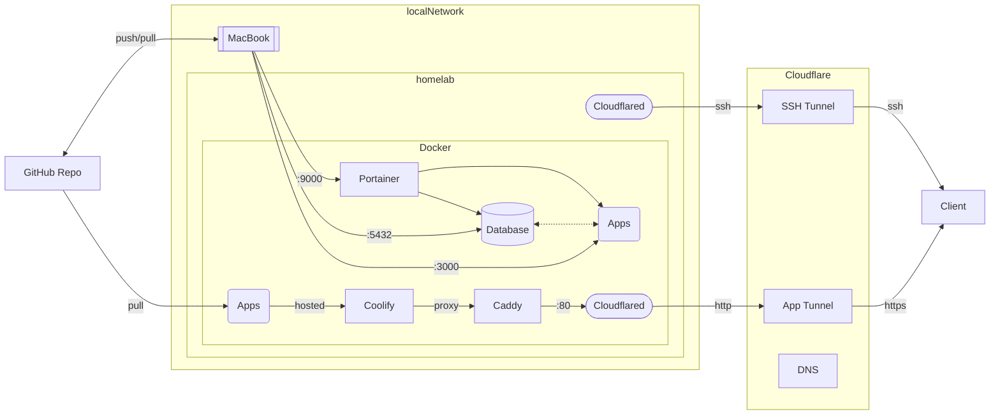

# Home Lab

Documentation and configurations on how my home lab server is setup.

## Hardware

- [Raspberry Pi 4 Model B 8GB](https://www.raspberrypi.org/products/raspberry-pi-4-model-b/)
- [64GB SanDisk Ultra microSDXC UHS-I Card](https://www.sandisk.com/home/memory-cards/microsd-cards/ultra-microsd-400gb)

## Software

- [Raspberry Pi OS (64bit)](https://www.raspberrypi.org/software/operating-systems/)
- [Docker](https://www.docker.com/)
- [Portainer](https://www.portainer.io/)

## Architecture

